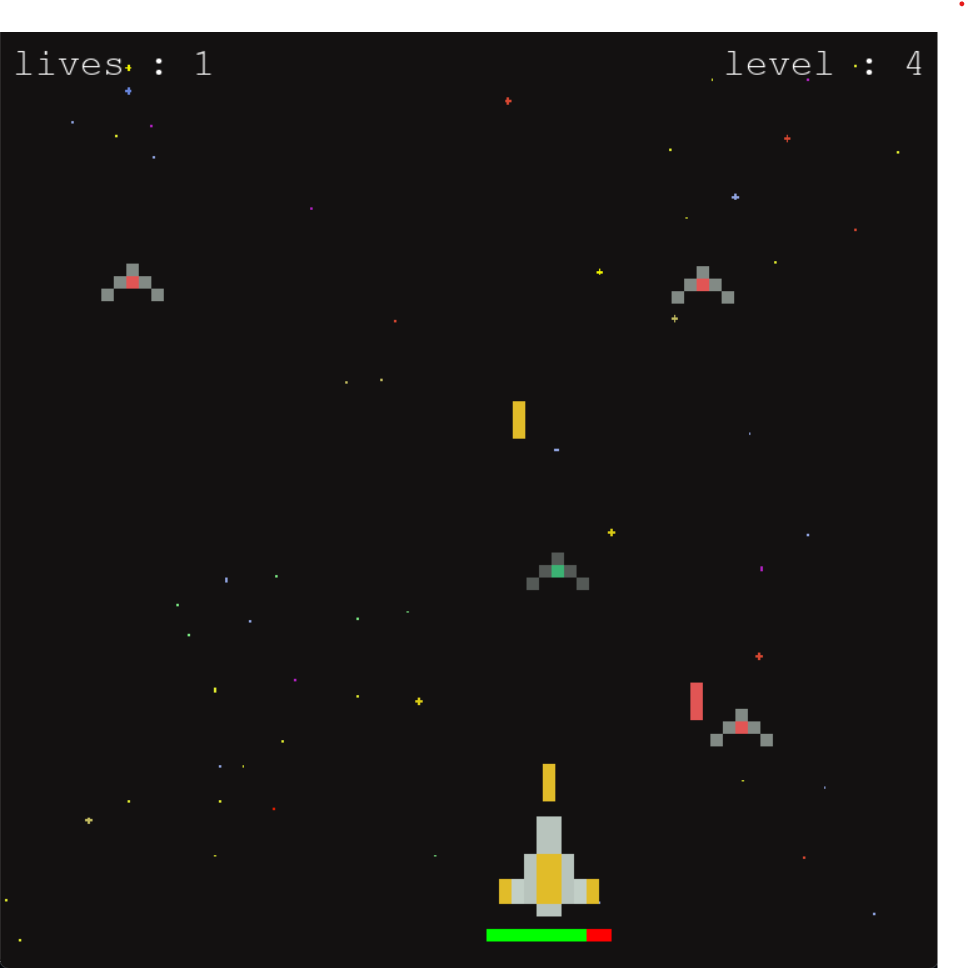

# Space Shooter Game
  A fast-paced **2D arcade shooter** built with [Pygame](https://www.pygame.org/).  
  Defend your ship against endless waves of enemies, dodge lasers, and survive as long as you can!
  
  
  

# Features 🎮 
  - **Player ship** with health bar
  - Multiple **enemy ships** (red, blue, green) with unique laser
  - **Increasing difficulty** with each wave
  - **Smooth controls** for movement & shooting
  - **Simple retro graphics** for a nostalgic feel

# Requirements 🛠
  - Python **3 and above**
  - Pygame library
  - Install Pygame with:
    ```bash
    pip install pygame
    ```
  
# How to Play 🎮
  1)  Clone or download this repository.
  2)  Make sure you have the Assets/ folder with all game images in the same directory as Space_Shooter.py.
  3)  Run:
       ```bash
       python Space_Shooter.py
       ```
  4)  Controls:
       Use arrow keys to move the ship ( ⬅ / ➡ / ⬆ / ⬇ )
       SPACE — Shoot lasers
      
# Project Structure 📂 
		Space_Shooter.py         # Main game code
		Assets/							
			  pixel_ship_red_small.png
			  pixel_ship_blue_small.png
			  pixel_ship_green_small.png
			  pixel_ship_yellow.png
			  pixel_laser_red.png
			  pixel_laser_blue.png
			  pixel_laser_green.png
			  pixel_laser_yellow.png
			  background-black.png
		 		gameplay_screenshot.png
		 
# Future Ideas 💡
  1)  Power-ups (shield, rapid fire)
  2)  Boss fights
  3)  Sound effects & background music
  4)  Score system

# License 📜 
  This project is open source.
